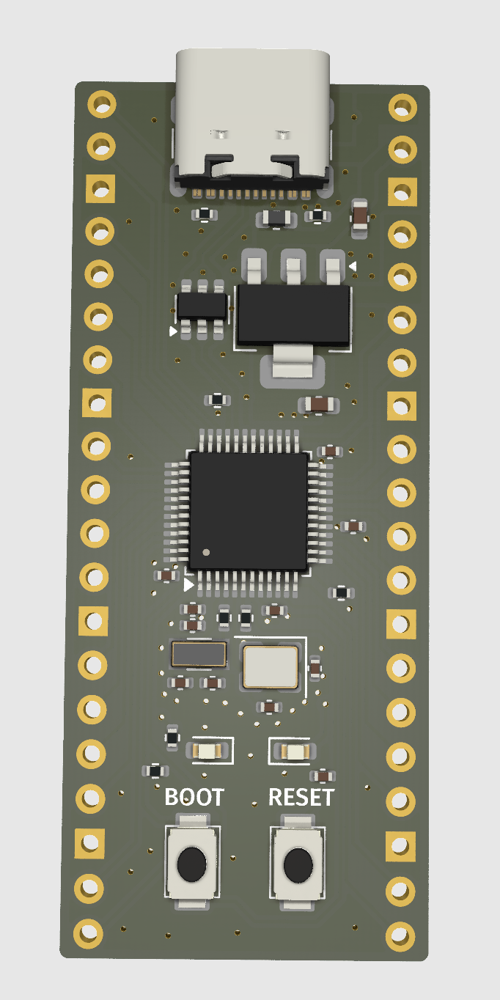
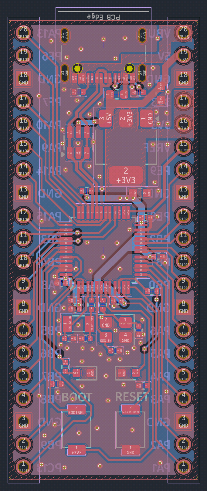

# Cool stm32 dev board

Get this cheap and small stm32 dev board! it's a drop in replacement for a raspberry pi pico, so upgrade your device's performance at no cost!

It even supports USB, has 2 on-board LEDs and has multiple ADC channels! How awesome :D

### Features

It has a STM32F373CCT on it, which has:
- 256KB flash
- 72MHz
- 32 Bit
- ARM® Cortex®-M4
- USB support

Paired with this processor this dev board is:
- In a raspberry pi pico foorprint - direct replacement
- Duan oscillators, accurate RTC timing
- USB C!
- 2 user LEDs
- dual layer design - low fabrication cost

### Why?

Why use a stm32 instead of a raspberry pi2040? The STM32 chips are more powerful, has more dedicated i/o pins and USB support!

As you can see, almost all signal traces are routed on a single layer, thus preserving the maximal amount of signal integrity. The ground plane is also not slices up, sllowing direct current return paths.

